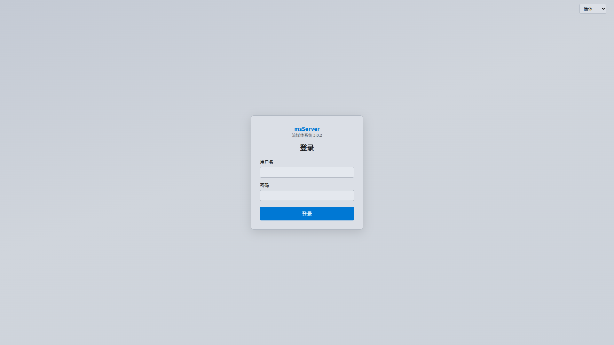
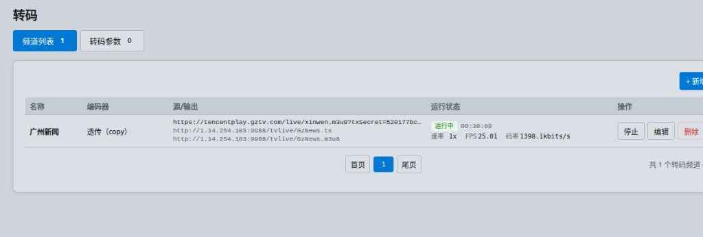
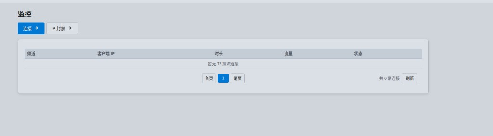
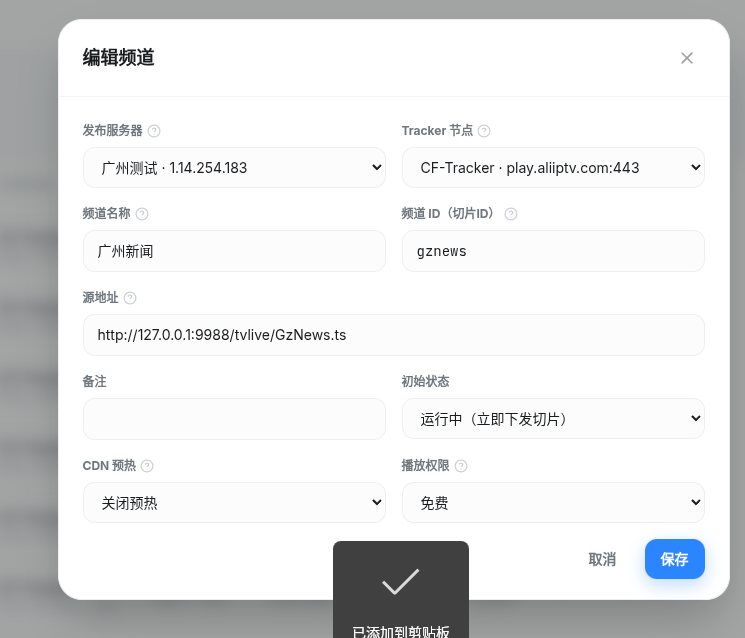

# msServer 3.0.2

**流媒体转码 / DVB 接收 / 多协议出流平台**（C++ 重写版）

> 历史 2.x 版本为 Go 实现，源码已不可用。自 **3.0** 起全部以 **C++** 重写：单二进制部署、Web 管理嵌入内存、CentOS 7 / Ubuntu 22.04+ 可运行。

默认管理端口：**9988** · 产品标识：`Server: msServer/3.0.2`

---

## 界面预览（3.0.2）

| 登录 | 转码频道 |
|------|----------|
|  |  |

| 监控连接 | 发布源配置示例 |
|----------|----------------|
|  |  |

更多截图见 [`docs/screenshots-3.0.2/`](docs/screenshots-3.0.2/)。

---

## 一、软件概述

### 产品定位

面向 **IPTV、酒店电视、私有直播、运营商边缘节点** 等场景的一体机软件：

**拉流 / DVB 收流 → 解扰（可选）→ 转码或透传 → 多协议出流 → Web 运维**

单机即可完成频道管理、硬件转码、HTTP-TS/HLS/RTMP/组播/私有协议出流，以及防火墙与授权。

### 与 2.x（Go）的关系

| 项目 | 2.x（Go，源码已丢失） | 3.x（C++，当前） |
|------|----------------------|------------------|
| 语言 | Go | **C++** |
| Web | 外置/分离 | **嵌入二进制** |
| DVB | 视版本而定 | **原生 DVB-C/T/S + CAS/OSCam** |
| 转码 | 外挂 FFmpeg | **内置定制 FFmpeg + 硬件加速** |
| 部署 | 多文件 | **单文件 + 可选 nginx/oscam** |
| 系统服务 | 支持 | **`-d` / `-stop` / `-install` / `-uninstall`** |

3.x 在能力上覆盖并扩展了 2.x 的转码、多协议出流、热更新与运维控制台，并新增完整 DVB 接收与解扰链路。

### 运行环境

| 平台 | 说明 |
|------|------|
| **Linux 生产** | CentOS 7+、Ubuntu 22.04+（正式包推荐 el7 容器编译产物） |
| **硬件转码** | NVIDIA（NVENC）、Intel（QSV/VAAPI 等，视驱动） |
| **管理端** | 现代浏览器访问 Web（简体 / 繁體 / English） |
| **依赖** | 正式包尽量静态；运行时可选系统防火墙（ufw/firewalld/iptables） |

---

## 二、功能介绍（完整）

### 1. 整体优势

- **单文件交付**：管理页、静态资源 gzip 后写入二进制，运行时内存提供
- **崩溃隔离**：DVB 适配器异常、非法 JSON 等不拖死整个进程
- **异步不卡 Web**：频点/频道启停、源探测、转码控制走后台队列
- **授权体系**：设备指纹 + 授权码激活；未激活引导授权页
- **多语言**：简体 / 繁體 / English

### 2. DVB 接收

- **DVB-C / DVB-T / DVB-S**（含 C 波段 LNB、通用与高级调谐）
- 频点：锁频、信号、频道列表、启停与热更新
- 扫描入库、自定义 slug、同频点多频道
- 扫描后可自动开流；台名编码处理（含繁中等场景）
- **TsHub** 多客户端零拷贝扇出；HTTP 背压与连接上限可调

### 3. CAS / OSCam / CAM

- **内置 OSCam** 配置与联动
- **USB 读卡自动绑定**
- CAM / 解扰绑定；单频道配置可定向热生效

### 4. IPTV / 流媒体转码（内置 FFmpeg）

- **透传 / 软解硬编 / 硬解硬编**
- **NVIDIA NVENC**、**Intel** 硬件加速；概览页显卡占用、编解码、显存、温度
- 去隔行（含 CUDA 相关模式）、码率/GOP/音视频模板
- 多音轨、字幕压制 / 打包音轨
- **AV1 可封装进 MPEG-TS**（HTTP-TS / mskey）
- 源地址热更新、频道启停/批量重启、实时状态与日志
- 并发转码路数可配置（默认可不限制）
- **3.0.2**：HTTP-TS 与 HLS 同开时，tee **主流优先**；HLS 等支路失败自动重连，避免单播空流

### 5. 多协议出流

| 协议 / 方式 | 说明 |
|-------------|------|
| **HTTP-TS** | `/live/`、`/tvlive/*.ts` 长连接单播 |
| **HLS** | MPEG-TS / fMP4；推荐 `/dev/shm` 内存盘 |
| **UDP / RTP 组播** | 地址模板、TTL、绑定网卡 |
| **RTMP** | 推流 / 拉流（nginx-rtmp），推拉可分别鉴权 |
| **mskey** | 私有 **KCP + AES-128-GCM**；`mskey://host:port/live|tvlive/<频道>`，端口热生效 |
| **Nginx HLS 边缘** | 独立端口提供切片，不转发管理 API |

- 防盗链：`?k=`、nginx `secure_link`（`t` + `sign`）；本机 `127.0.0.1` 免鉴权便于联调
- HLS CDN 回调 / 预热、切片通知
- 组播出口可绑网卡（延续 2.x「UDP 代理绑网卡」类需求）

### 6. 监控与安全

- **TS 拉流连接监控**：频道、客户端 IP、时长、流量
- **3.0.2**：同机多连接按会话独立计数（修复「本机 pub 拉本机 TS 却显示 0 连接」）
- IP 封禁；出流白名单可与系统防火墙联动
- **防火墙 Web 管理**：ufw / firewalld / iptables
- 登录 Cookie 会话；账户改密；敏感接口鉴权

### 7. 系统与运维（Web）

- **概览**：CPU / 内存 / 网卡、运行时间、接收卡与转码路数、GPU
- **接收**：频点 / 频道
- **转码**：频道列表、编码器模板
- **监控**：连接 / IP 封禁
- **系统**：网络、防火墙、CAM、出流、Nginx、NTP、备份、日志、账户、授权

配置以 JSON 持久化（如 `ms-dvb.json`），首次可自动生成默认项。

### 8. 进程与部署命令

```text
./msServer              # 前台（调试）
./msServer -d           # 守护进程
./msServer -stop        # 停止
./msServer -install     # 安装系统服务
./msServer -uninstall   # 卸载系统服务
```

---

## 三、典型架构

```text
  DVB 卡 / HTTP·HTTPS·RTMP 等源
            │
            ▼
     ┌──────────────┐
     │   msServer   │  C++ · Web:9988
     │ 收流·解扰·转码 │
     └──────┬───────┘
            │
    ┌───────┼───────────┬────────────┬──────────┐
    ▼       ▼           ▼            ▼          ▼
 HTTP-TS   HLS        RTMP        组播       mskey
 /tvlive   /dev/shm   nginx       UDP/RTP    KCP+AES
```

---

## 四、快速开始

1. 将发布包中的 `msServer` 放到目标机，赋予执行权限  
2. `./msServer -d` 或 `-install` 后启动服务  
3. 浏览器打开 `http://服务器IP:9988`，登录并完成**授权**  
4. （可选）配置 DVB 频点 / 转码频道 / 出流与防火墙  
5. 播放示例：  
   - `http://IP:9988/tvlive/<频道>.ts`  
   - `http://IP:9988/tvlive/<频道>.m3u8`  
   - `mskey://IP:<端口>/tvlive/<频道>`

HLS 高并发建议使用内存盘目录（如 `/dev/shm/msdvb`）。

---

## 五、版本说明

| 版本 | 说明 |
|------|------|
| **3.0.2** | 当前：tee 主流/支路重连、监控连接唯一 ID、版本号 3.0.2 |
| 3.0.x | C++ 首代完整产品线（DVB + 转码 + 多协议出流） |
| 2.0.x | Go 旧版（源码已丢失，仅历史发布包可参考） |

详细发布说明见：[docs/RELEASE-3.0.2.md](docs/RELEASE-3.0.2.md)

---

## 六、仓库说明

- 本仓库用于 **产品介绍、截图与发布说明**（及历史 2.x 文档归档）。
- 工程源码与持续开发在内部/关联仓库维护；对外以 **Release 二进制** 为准。

---

## 许可证与授权

商业授权：通过 Web「系统 → 授权」粘贴授权码激活。未授权设备功能受限。

---

*msServer 3.0.2 · C++ Streaming Platform*
